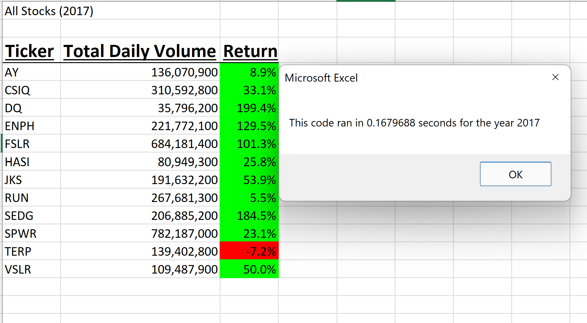
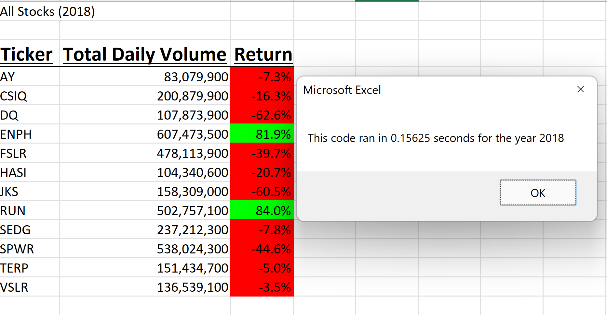

# stock_analysis
In this analysis we compared stocks using VBA from the 2017 and 2018 fiscal years. 
Here is how 2017 looked.

And this is how 2018 looked in comparison

As yobu can see, 2017 had a better performing year compared to 2018. 2018 spent a lot of time in the negative. 